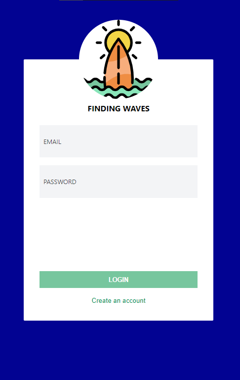
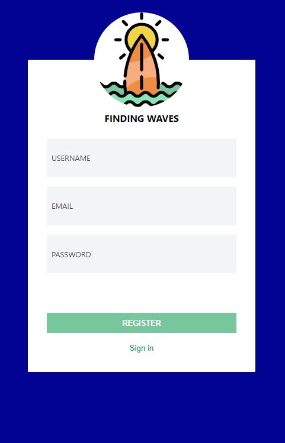
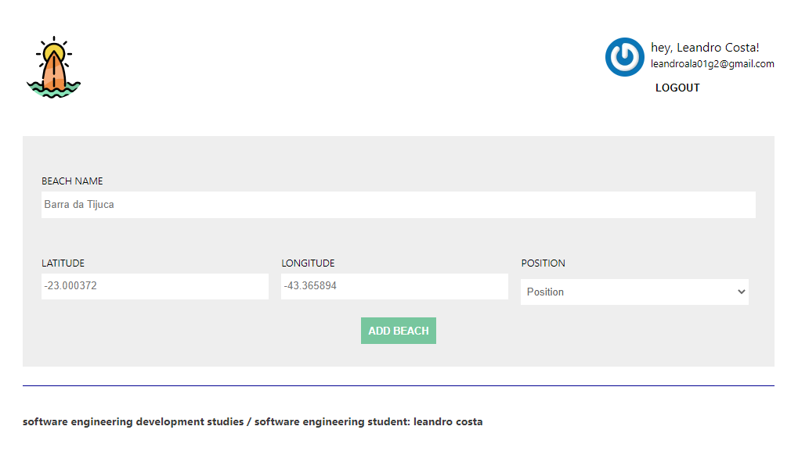
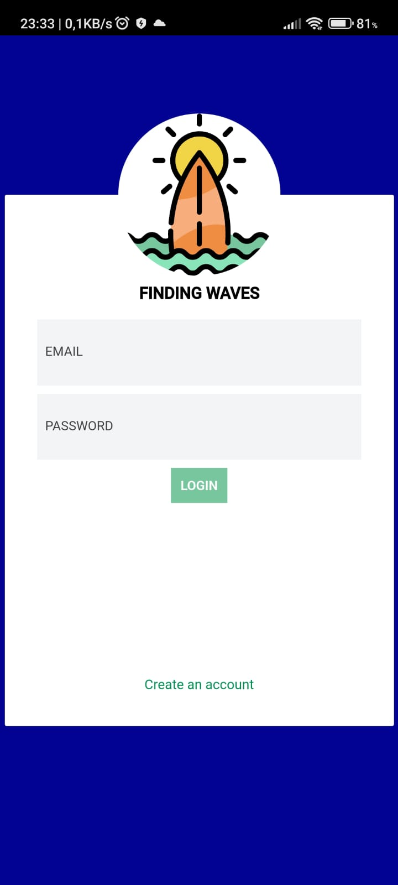

#  🌊🌊cloud-surf-api🌊🌊

Aplicação de estudo desenvolvida para aprender tecnologias e fixar conceitos da web.

### Tecnologias utilizadas:
* Node.js
 * MongoDB
 * Express
 * jest
 * Mongoose
 * TDD
 * Docker
### Novos aprendizados:
#### Node.js:
Em Node.js, pude aprender a criar um **API Rest** utilizando conceitos básicos de desenvolvimento de uma aplicação, como:
* Criação de um CRUD em Node.js;
* A separação de responsabilidades através de arquivos e funções de acordo com os padrões utilizados pela comunidade;
* Roteamento com o **Express**;
* Aplicação da Arquitetura MVC aplicado a este Projeto
* Aplicação do Jest orientado a testes de unidades
### Sobre o app
O App foi criado com a intenção de poder mostrar para o usuario qual é a melhor Praia para poder Surfar.

**pageLogger:**

**PageCadastro**

**PageCadastroPraia**

**Possui responsividade, ou seja Funciona em aparelhos moveis!**

**Este App foi Desenvolvido por https://github.com/waldemarnt / Estudado e Revisado por https://github.com/leandrofuenge**
